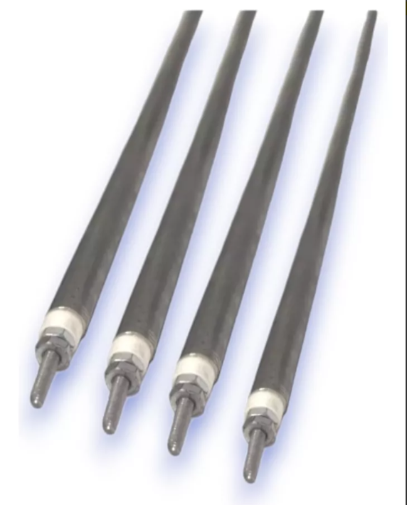
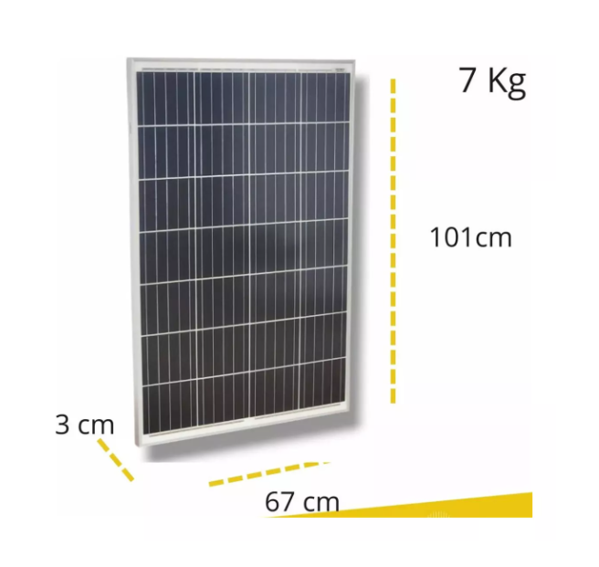
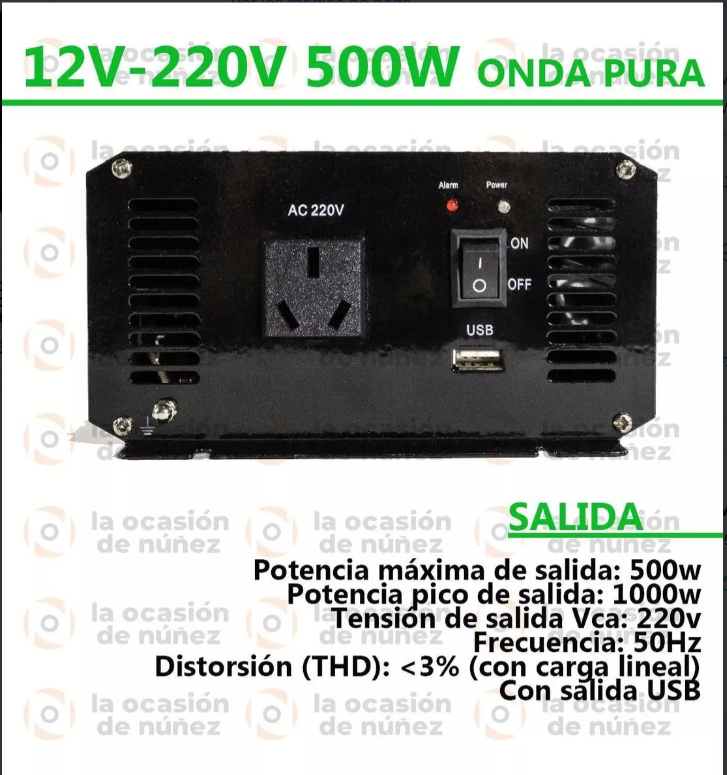
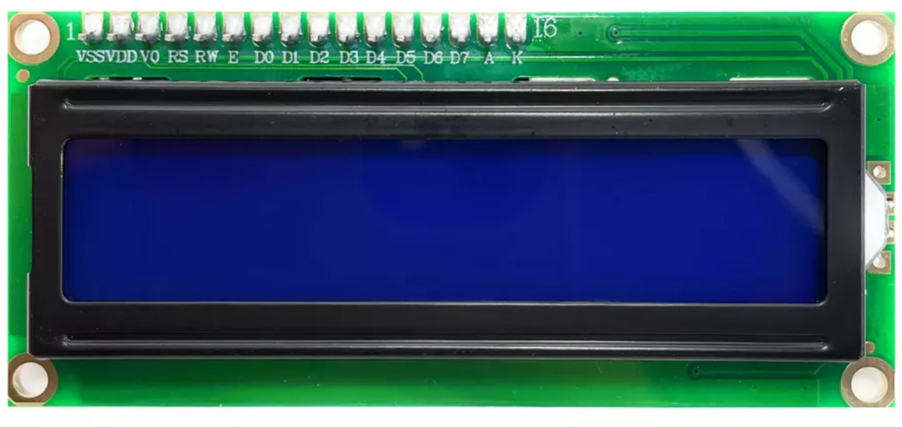
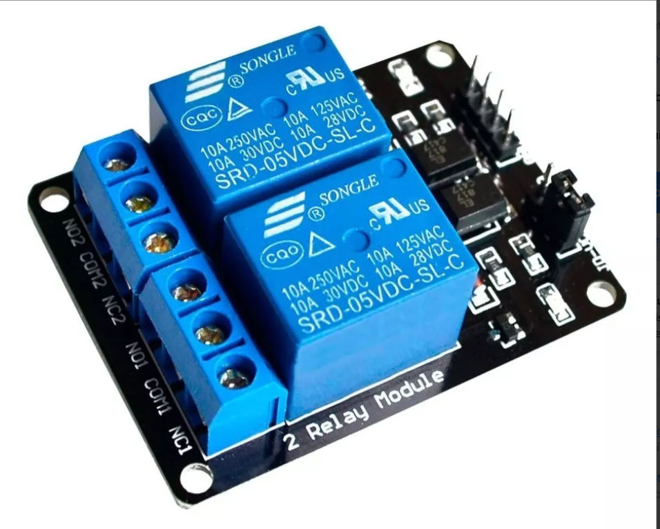
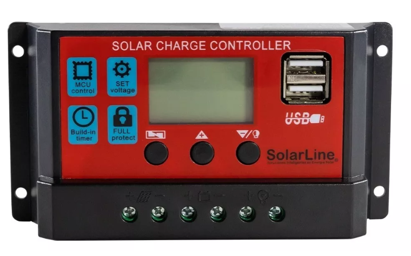

# Trabajo practico N° 1

## Deshidratador Tecnologico

### Proyecto del curso de sistemas embebidos

#### Jose Mariano Emmanuel


## email_: marianoe.jose@gmail.com

---


  Proyecto de Deshidratador de Alimentos 


    


**Objetivo:**

Desarrollar un sistema de _deshidratación_ de _alimentos_ utilizando energía solar calórica y fotovoltaica, controlado por un La placa NUCLEO F429ZI. Este sistema permitirá conservar una amplia variedad de alimentos por un período prolongado, extendiendo su vida útil y abriendo nuevas posibilidades para su uso y consumo.

**Descripción:**

El sistema consistirá en un deshidratador modular compuesto por bandejas apilables que albergarán los alimentos a deshidratar. Cada bandeja estará equipada con un sensor de temperatura y un elemento calefactor.
 La energía para el funcionamiento del sistema provendrá de paneles solares fotovoltaicos, almacenándose en una batería para su uso durante las horas sin luz solar.

Funcionamiento:

*   Carga de alimentos: Los alimentos frescos y lavados se colocan en las bandejas del deshidratador.

*   Control de temperatura: El Arduino Uno leerá los datos de los sensores de temperatura en cada bandeja y ajustará la potencia de los elementos calefactores para mantener la temperatura deseada durante todo el proceso de deshidratación.

*   Energía solar: Durante el día, los paneles solares fotovoltaicos proporcionarán energía eléctrica al sistema, alimentando el Arduino Uno y los elementos calefactores.

*   Batería: La energía solar excedente se almacenará en una batería para su uso durante la noche o en días nublados, garantizando un funcionamiento continuo del sistema.

*   Monitoreo y control: El usuario podrá monitorear el estado del sistema y ajustar parámetros como la temperatura y el tiempo de deshidratación a través de una interfaz de usuario, como una pantalla LCD o una aplicación móvil.
-----

**Componentes:**


*   Placa con microcontrolador 
    *   **Sistema de control** 
    [VER](https://articulo.mercadolibre.com.ar/MLA-925594160-arduino-uno-ch340-ccable-usb-compatible-_JM#position%3D8%26search_layout%3Dgrid%26type%3Ditem%26tracking_id%3Dad2f852f-0376-4c8a-aa21-a637e89b38eb)
      Ver informacion

       

    -----


*   Sensores de temperatura (para cada bandeja)
    * **LM 35 Sensor Tempreatura** 
    [VER](https://articulo.mercadolibre.com.ar/MLA-1664692618-sensor-analogico-temperatura-lm35-55c-a-150c-_JM#position%3D7%26search_layout%3Dgrid%26type%3Ditem%26tracking_id%3D11ef63c4-b708-4618-abbd-f49fd6b1f79a) 
    ** Ver informacion


    ----

*   Elementos calefactores (para cada bandeja)
    * **Resistores**
    [VER](https://articulo.mercadolibre.com.ar/MLA-1423897837-4-resistencias-velas-horno-electrico-grill-43cm-4x-43-cm-_JM#polycard_client=recommendations_vip-pads-up&reco_backend=vip_pads_up_ranker_retrieval_system_odin_marketplace&reco_client=vip-pads-up&reco_item_pos=0&reco_backend_type=low_level&reco_id=46c4f2c3-5d62-428c-b2f6-1c6b63cb730d&is_advertising=true&ad_domain=VIPDESKTOP_UP&ad_position=1&ad_click_id=NThkMDBjNjEtMDUzYy00MTg0LWFiODktZTlhNzhlYzAzNzM1&gid=1&pid=1) 
     Ver informacion

    -----


* Panel solar fotovoltaicos
    *   **Caracteristicas 12V 100W**
    [VER](https://articulo.mercadolibre.com.ar/MLA-1773632730-panel-solar-monocristalino-100w-12v-36-celdas-_JM#position%3D17%26search_layout%3Dgrid%26type%3Ditem%26tracking_id%3D94044454-aece-4034-a867-307de7d02b6c)
      Ver informacion

    ---


*  Bateria AGM/GEL 12V 55Ah 
    * **Batería** [VER](https://articulo.mercadolibre.com.ar/MLA-819368307-bateria-agm-gel-12v-55ah-solar-ups-ciclo-profundo-cenvio-_JM#position%3D3%26search_layout%3Dstack%26type%3Ditem%26tracking_id%3Dca647c7c-fd56-4fd4-a40e-2ed9173971c2) 
     Ver informacion 

    ------

*  Inversor 1000w 12v - 220v 50 Hz
    * **Inversor DC/AC** [VER](https://www.mercadolibre.com.ar/inversor-conversor-de-corriente-onda-senoidal-pura-500va/p/MLA24149272#searchVariation%3DMLA24149272%26position%3D1%26search_layout%3Dgrid%26type%3Dproduct%26tracking_id%3D0d206164-eaae-4b62-961b-cafd6d5ef914) 
     Ver informacion 

    -----

* Pantalla LCD o aplicación móvil (opcional)
    * **Pantalla LCD** [VER](https://articulo.mercadolibre.com.ar/MLA-1785207108-display-lcd-1602-hd44780-azul-16x2-16-pin-arduino-compatible-_JM#is_advertising=true&position=2&search_layout=stack&type=pad&tracking_id=91af5a7b-685b-412f-9829-71332057f2c4&is_advertising=true&ad_domain=VQCATCORE_LST&ad_position=2&ad_click_id=NDM5OGE2NDctMTYyMi00YzUzLTljZTYtYjQ3ZTI4MGU2YWMx&gid=1&pid=1)
     Ver informacion 

    -----

* Modulo Relay Rele De 2 Canales 5v 10a
    * **RELE** [VER](https://www.mercadolibre.com.ar/modulo-relay-rele-de-2-canales-5v-10a-arduino-pic-avr/p/MLA32487694#searchVariation%3DMLA32487694%26position%3D2%26search_layout%3Dgrid%26type%3Dproduct%26tracking_id%3D9fe1d594-1b47-4075-8b89-bbdd6339737a)
     Ver informacion 

    ----


*   Regulador de Carga 10 Amper c/Display LCD c/USB
    * **Regulador Carga** [VER](https://articulo.mercadolibre.com.ar/MLA-687576849-regulador-de-carga-para-paneles-solares-10-amper-display-dig-_JM#position%3D1%26search_layout%3Dstack%26type%3Ditem%26tracking_id%3D668ec46b-3b3e-4b8c-bead-a5db498f6a55)
     Ver informacion 

    -----


 
**Código de programación:**

```c++

int senTemp;
float estadoTemp;
float TEMP;


void setup() {
  Serial.begin(9600);
  // put your setup code here, to run once:

}

void loop() {
  senTemp = digitalRead

void loop()
{
  sensorTemp = analogRead(A0);
  tempSen = (sensorTemp * (5.0/1024));
  temp = (tempSen * 100)-55;
  Serial.println(temp, 1); // quiero un solo digito despeus de la coma
  delay(1000);
}
   

```


 **El código de programación para controlará las siguientes funciones:**__


* • Lectura de datos de los sensores de temperatura

* • Ajuste de la potencia de los elementos calefactores

* • Gestión de la energía solar y la batería

* • Monitoreo del estado del sistema

* • Interfaz de usuario (opcional)

**Ventajas:**

•   Conservación de alimentos: El deshidratador permite conservar una amplia variedad de alimentos por un período prolongado, reduciendo el desperdicio y aumentando la disponibilidad de alimentos nutritivos.

•   Energía solar: El uso de energía solar reduce el impacto ambiental y los costos operativos del sistema.

•   Control preciso: El Arduino Uno permite un control preciso de la temperatura y el tiempo de deshidratación, optimizando el proceso para cada tipo de alimento.

•   Monitoreo y control: El usuario puede monitorear el estado del sistema y ajustar parámetros para obtener resultados óptimos.
Consideraciones:

•   Selección de alimentos: Es importante seleccionar alimentos adecuados para el proceso de deshidratación, considerando su contenido de agua y su textura.

•   Preparación de alimentos: Los alimentos deben prepararse adecuadamente antes de deshidratarlos, por ejemplo, cortarlos en rodajas finas o eliminar la piel.

•   Tiempo de deshidratación: El tiempo de deshidratación varía según el tipo de alimento, la temperatura y la humedad del ambiente.

•   Almacenamiento: Los alimentos deshidratados deben almacenarse en recipientes herméticos en un lugar fresco y seco.
Conclusión:

El deshidratador de alimentos con Arduino Uno es una herramienta útil para conservar alimentos de manera natural y eficiente, aprovechando la energía solar y ofreciendo un control preciso del proceso. Este proyecto puede adaptarse a diferentes necesidades y escalas, desde uso doméstico hasta aplicaciones comerciales a pequeña escala.

 
 

* Componentes:

|   Componentes |   Proveedor   |   información |
|   ------      |   ----        |   -------     |
|   ARDUINO UNO |    $11.000    |   [ver](https://articulo.mercadolibre.com.ar/MLA-925594160-arduino-uno-ch340-ccable-usb-compatible-_JM#position%3D8%26search_layout%3Dgrid%26type%3Ditem%26tracking_id%3Dad2f852f-0376-4c8a-aa21-a637e89b38eb)   |
|   LM 35       |    $6.000    |   [ver](https://articulo.mercadolibre.com.ar/MLA-1664692618-sensor-analogico-temperatura-lm35-55c-a-150c-_JM#position%3D7%26search_layout%3Dgrid%26type%3Ditem%26tracking_id%3D11ef63c4-b708-4618-abbd-f49fd6b1f79a)    |
|   CALEFACTOR  |    $23.000    |   [ver](https://articulo.mercadolibre.com.ar/MLA-1423897837-4-resistencias-velas-horno-electrico-grill-43cm-4x-43-cm-_JM#polycard_client=recommendations_vip-pads-up&reco_backend=vip_pads_up_ranker_retrieval_system_odin_marketplace&reco_client=vip-pads-up&reco_item_pos=0&reco_backend_type=low_level&reco_id=46c4f2c3-5d62-428c-b2f6-1c6b63cb730d&is_advertising=true&ad_domain=VIPDESKTOP_UP&ad_position=1&ad_click_id=NThkMDBjNjEtMDUzYy00MTg0LWFiODktZTlhNzhlYzAzNzM1&gid=1&pid=1)    |
|   PANEL SOLAR |    $94.000    |   [ver](https://articulo.mercadolibre.com.ar/MLA-1773632730-panel-solar-monocristalino-100w-12v-36-celdas-_JM#position%3D17%26search_layout%3Dgrid%26type%3Ditem%26tracking_id%3D94044454-aece-4034-a867-307de7d02b6c)    |
|   BATERIA |    $188.000    |   [ver](https://articulo.mercadolibre.com.ar/MLA-819368307-bateria-agm-gel-12v-55ah-solar-ups-ciclo-profundo-cenvio-_JM#position%3D3%26search_layout%3Dstack%26type%3Ditem%26tracking_id%3Dca647c7c-fd56-4fd4-a40e-2ed9173971c2)    |
|   INVERSOR |    $137.000    |   [ver](https://www.mercadolibre.com.ar/inversor-conversor-de-corriente-onda-senoidal-pura-500va/p/MLA24149272#searchVariation%3DMLA24149272%26position%3D1%26search_layout%3Dgrid%26type%3Dproduct%26tracking_id%3D0d206164-eaae-4b62-961b-cafd6d5ef914)    |
|   LCD |    $6.000    |   [ver](https://articulo.mercadolibre.com.ar/MLA-1785207108-display-lcd-1602-hd44780-azul-16x2-16-pin-arduino-compatible-_JM#is_advertising=true&position=2&search_layout=stack&type=pad&tracking_id=91af5a7b-685b-412f-9829-71332057f2c4&is_advertising=true&ad_domain=VQCATCORE_LST&ad_position=2&ad_click_id=NDM5OGE2NDctMTYyMi00YzUzLTljZTYtYjQ3ZTI4MGU2YWMx&gid=1&pid=1)    |
|   REGULADO |    $27.000    |   [ver](https://articulo.mercadolibre.com.ar/MLA-687576849-regulador-de-carga-para-paneles-solares-10-amper-display-dig-_JM#position%3D1%26search_layout%3Dstack%26type%3Ditem%26tracking_id%3D668ec46b-3b3e-4b8c-bead-a5db498f6a55)    |
|   MOD RELE |    $5.000    |   [ver](https://www.mercadolibre.com.ar/modulo-relay-rele-de-2-canales-5v-10a-arduino-pic-avr/p/MLA32487694#searchVariation%3DMLA32487694%26position%3D2%26search_layout%3Dgrid%26type%3Dproduct%26tracking_id%3D9fe1d594-1b47-4075-8b89-bbdd6339737a)    |
|   ADICIONAL |    $100.000    |   [ver](https://www.mercadolibre.com.ar/rollo-cable-1mm-negro-unipolar-100m-trefilcon-norma-iram/p/MLA28676703?pdp_filters=item_id:MLA1660249052#is_advertising=true&searchVariation=MLA28676703&position=1&search_layout=grid&type=pad&tracking_id=045cec5e-7b1a-452b-a5c1-2c3211692758&is_advertising=true&ad_domain=VQCATCORE_LST&ad_position=1&ad_click_id=M2M3MTZmNmItODRhOC00YzllLTgzZGEtZWQ4OTkxYTFhMzA0)    |
|   TOTAL   | $597.000  |   [Link](https://www.mercadopago.com.ar/subscriptions/checkout?preapproval_plan_id=2c9380847dc3a0de017dc3b19ff00008) |


-----


* **Sistema**

    

    ** Sume algun punto?

    


