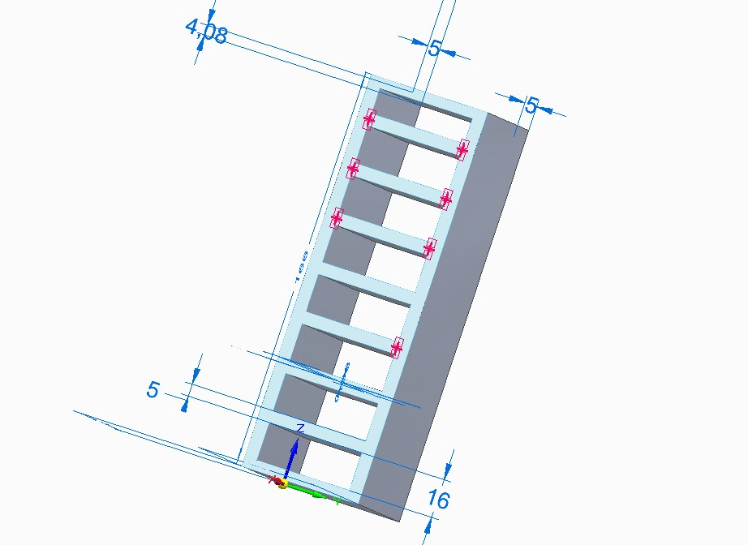

# Trabajo practico N° 1
## Deshidratador Tecnologico
### Proyecto del curso de sistemas embebidos
#### Jose Mariano Emmanuel

---

  El siguiente proyecto *Deshidratador Tecnológico* Es el resultado de una combinación de conocimientos nuevos y conocimientos ya adquiridos en otras etapas de formación. 

  Quisiera agradecer a los organizadores y al equipo de docentes, que con tanta dedicación deciden transmitir sus saberes, y así formar nuevos ciudadanos capaces de caminar con la tecnología. 

  **Prologó:**

  Proyecto de Deshidratador de Alimentos 


    


**Objetivo:**

Desarrollar un sistema de deshidratación de alimentos utilizando energía solar calórica y fotovoltaica, controlado por un La placa NUCLEO F429ZI. Este sistema permitirá conservar una amplia variedad de alimentos por un período prolongado, extendiendo su vida útil y abriendo nuevas posibilidades para su uso y consumo.

**Descripción:**

El sistema consistirá en un deshidratador modular compuesto por bandejas apilables que albergarán los alimentos a deshidratar. Cada bandeja estará equipada con un sensor de temperatura y un elemento calefactor regulado por la placa Nucleo F429ZI. La energía para el funcionamiento del sistema provendrá de paneles solares fotovoltaicos, almacenándose en una batería para su uso durante las horas sin luz solar.

Funcionamiento:

*   Carga de alimentos: Los alimentos frescos y lavados se colocan en las bandejas del deshidratador.

*   Control de temperatura: El Arduino Uno leerá los datos de los sensores de temperatura en cada bandeja y ajustará la potencia de los elementos calefactores para mantener la temperatura deseada durante todo el proceso de deshidratación.

*   Energía solar: Durante el día, los paneles solares fotovoltaicos proporcionarán energía eléctrica al sistema, alimentando el Arduino Uno y los elementos calefactores.

*   Batería: La energía solar excedente se almacenará en una batería para su uso durante la noche o en días nublados, garantizando un funcionamiento continuo del sistema.

*   Monitoreo y control: El usuario podrá monitorear el estado del sistema y ajustar parámetros como la temperatura y el tiempo de deshidratación a través de una interfaz de usuario, como una pantalla LCD o una aplicación móvil conectada a la F429ZI.

**Componentes:**


    * Opcional f429zi
        1. u otra de la familia Núcleo


*   Sensores de temperatura (para cada bandeja)
    * LM 35

*   Elementos calefactores (para cada bandeja)
    * Resistores

•   Paneles solares fotovoltaicos

•   Batería

•   Pantalla LCD o aplicación móvil (opcional)

 
**Código de programación:**

```c++
#include "mbed.h"

#
int main()
{
  
}


    

```


 **El código de programación para controlará las siguientes funciones:**__


* • Lectura de datos de los sensores de temperatura

* • Ajuste de la potencia de los elementos calefactores

* • Gestión de la energía solar y la batería

* • Monitoreo del estado del sistema

* • Interfaz de usuario (opcional)

**Ventajas:**

•   Conservación de alimentos: El deshidratador permite conservar una amplia variedad de alimentos por un período prolongado, reduciendo el desperdicio y aumentando la disponibilidad de alimentos nutritivos.

•   Energía solar: El uso de energía solar reduce el impacto ambiental y los costos operativos del sistema.

•   Control preciso: El Arduino Uno permite un control preciso de la temperatura y el tiempo de deshidratación, optimizando el proceso para cada tipo de alimento.

•   Monitoreo y control: El usuario puede monitorear el estado del sistema y ajustar parámetros para obtener resultados óptimos.
Consideraciones:

•   Selección de alimentos: Es importante seleccionar alimentos adecuados para el proceso de deshidratación, considerando su contenido de agua y su textura.

•   Preparación de alimentos: Los alimentos deben prepararse adecuadamente antes de deshidratarlos, por ejemplo, cortarlos en rodajas finas o eliminar la piel.

•   Tiempo de deshidratación: El tiempo de deshidratación varía según el tipo de alimento, la temperatura y la humedad del ambiente.

•   Almacenamiento: Los alimentos deshidratados deben almacenarse en recipientes herméticos en un lugar fresco y seco.
Conclusión:

El deshidratador de alimentos con Arduino Uno es una herramienta útil para conservar alimentos de manera natural y eficiente, aprovechando la energía solar y ofreciendo un control preciso del proceso. Este proyecto puede adaptarse a diferentes necesidades y escalas, desde uso doméstico hasta aplicaciones comerciales a pequeña escala.

 

**Librerías necesarias:**
 

* Componentes:

|   componentes     |       precio      |       información     |
|       ------       |       ----        |       -------         |
|       Nuc F429ZI   |       $500|   [Ver](https://articulo.mercadolibre.com.ar/MLA-706159868-sensor-analogico-temperatura-lm35-55c-a-150c-nubbeo-_JM#is_advertising=true&position=1&search_layout=grid&type=pad&tracking_id=17405246-6044-4c63-96a2-ed818a5f2f3f&is_advertising=true&ad_domain=VQCATCORE_LST&ad_position=1&ad_click_id=N2JkODM0ZmYtMTA4MS00ZDc2LTllNTYtNjA3YjNlMDI1NzZi "Precio Mercadolibre")    | 
|     LM 35            |   $4000     |      Ver []()       |
|    Elemento calefactor  | $5000    |    [ver]()      |

•   Sensor de temperatura LM35

•   Elemento calefactor (resistencia)

•   Potenciómetro

•   Cables DE CONEXION 